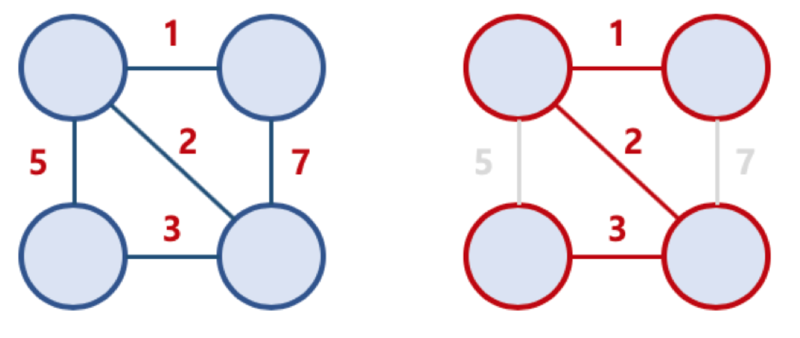

# 최소 신장 트리(Minimum Spannig Tree)
- 신장 트리 중 사용된 간선들의 가중치 합이 최소인 트리
> 신장 트리란, 그래프에서 노드와 노드를 이어주는 간선이 1개씩만 있는 부분 그래프이다(어떤 노드로 갈 수 있는 간선이 2개가 있다면 하나만 포함)


# 최소 신장 트리 조건
- 모든 노드를 포함
- 모든 노드가 연결
- 사이클이 없어야함
- 간선 가중치의 합이 최소

# 크루스칼 알고리즘(Kruskal Algorithm)
- 최소 비용 신장 트리를 찾는 알고리즘
- 가장 적은 비용으로 모든 노드를 연결

# 크루스칼 알고리즘 과정
1. 모든 간선들의 가중치를 오름차순 정렬
2. 가중치가 가정 적은 간선을 선택
3. 해당 간선이 연결하려는 노드 2개가 서로 연결되지 않은 상태일 때 연결(사이클 발생 여부 체크)
4. 2~3반복

# 프림 알고리즘(Prim Algorithm)
- 시작 노드를 기준으로 가장 작은 간선과 연결된 정점을 선택하여 신장 트리를 확장 시키는 알고리즘
- 정점 선택 기반

# 프림 알고리즘 과정
1. 임의의 간선을 선택하여
2. 선택한 간선의 노드로부터 가장 낮은 가중치를 갖는 노드를 선택
3. 모든 노드가 선택될 때 까지 반복

# 크루스칼 vs 프림
- 프림은 노드 위주, 크루스칼은 간선 위주
- 프림은 시작 노드를 정하고, 시작점에서 가까운 노드를 선택하면서 진행함으로 사이클이 생기지 않는다
- 크루스칼은 최소 비용의 간선을 차례로 대입 하면서 트리를 구성, 사이클 여부 확인 필요
- 프림의 경우 최소 거리의 노드를 찾는 부분에서 자료구조의 성능에 영향
- 크루스칼은 간선을 기준 정렬하는 과정이 오래 걸림
- 간선의 개수가 작은 경우 크루스칼, 간선의 개수가 많은 경우 프림

# 크루스칼 구현
```c++
typedef pair<int, int> ii;
vector<pair<int, ii> > EdgeList;    //<가중치, 간선정보>

int main() {
	//EdgeList에 간선을 추가한다.
	sort(EdgeList.begin(), EdgeList.end());

	UnionFind UF(V);    //각 정점을 상호 배타적인 집합으로 선언

	int mst_cost = 0;

	for(int i = 0; i < E; ++i) {
		if(!UF.isSameSet(EdgeList[i].second.first, EdgeList[i].second.second)){
			mst_cost += EdgeList[i].first;
			UF.unionSet(EdgeList[i].second.first, EdgeList[i].second.second);
		}
	}

	printf("Sum of edge's load included MST is %d\n" mst_cost);
}

```

# 크루스칼 시간 복잡도
- 간선 정렬에 O(ElogE)
- 정렬된 간선을 순회하며 UnionFind연산을 한번씩 수행, O(E)의 시간복잡도
- O(ElogE + E) = O(ElogE) = O(ElogV^2) = O(2*ElogV) = O(ElogV)


# 프림 구현
```c++
typedef pair<int, int> ii;
typedef vector<int> vi;
vi taken;
priority_queue<ii> pq;

void process (int vtx) {

	taken[vtx] = 1;
	
	for(int i = 0 ; i < (int)AdjList[vtx].size(); ++i) {
		ii v = AdjList[vtx][i];
		if(!taken[v.first])    pq.push(ii(-v.second, -v.first));
		//pq는 기본적으로 최대힙이므로 오름차순 정렬을 위해
		//부호 역전
	}
}

int main() {
	taken.assign(V, 0); //해당 정점이 MST구성에 사용 되었는지 여부를 저장
	process(0); //시작점을 설정하고 시작점과 인접한 정점, 가중치 쌍을 pq에 삽입

	int mst_cost = 0;

	while(!pq.empty()) {
		//pq에서 가중치가 가장 작고 번호가 빠른
		ii front = pq.top();    pq.pop();
		int w = -front.first, u = -front.second;
		if(!taken[u]){
			mst_cost += w;
			process(u);
		}
	}

	printf("MST value: %d\n", mst_cost);

}
```

# 프림 시간 복잡도
- 각 간선이 한번씩 pq에 삽입되고 제거
- O(ElogE) = O(ElogV) 