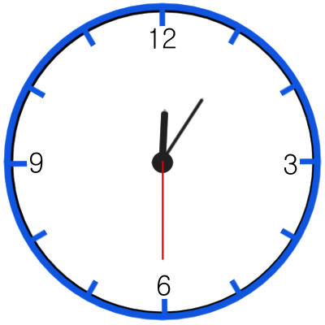
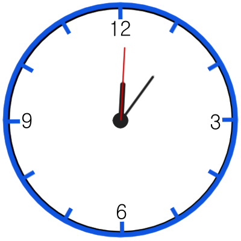
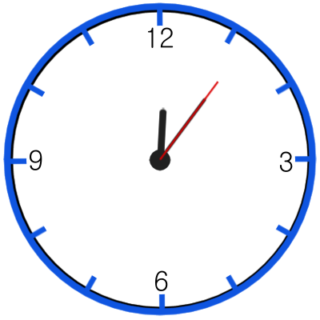
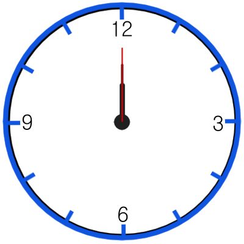
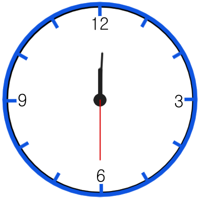
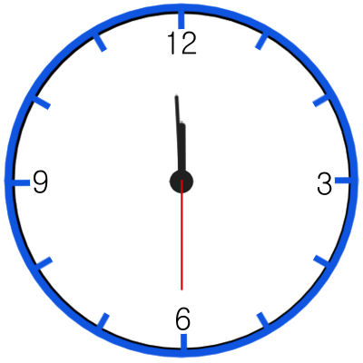

# 문제
시침, 분침, 초침이 있는 아날로그시계가 있습니다. 시계의 시침은 12시간마다, 분침은 60분마다, 초침은 60초마다 시계를 한 바퀴 돕니다. 따라서 시침, 분침, 초침이 움직이는 속도는 일정하며 각각 다릅니다. 이 시계에는 초침이 시침/분침과 겹칠 때마다 알람이 울리는 기능이 있습니다. 당신은 특정 시간 동안 알람이 울린 횟수를 알고 싶습니다.

다음은 0시 5분 30초부터 0시 7분 0초까지 알람이 울린 횟수를 세는 예시입니다.



가장 짧은 바늘이 시침, 중간 길이인 바늘이 분침, 가장 긴 바늘이 초침입니다.
알람이 울리는 횟수를 세기 시작한 시각은 0시 5분 30초입니다.
이후 0시 6분 0초까지 초침과 시침/분침이 겹치는 일은 없습니다.



약 0시 6분 0.501초에 초침과 시침이 겹칩니다. 이때 알람이 한 번 울립니다.
이후 0시 6분 6초까지 초침과 시침/분침이 겹치는 일은 없습니다.



약 0시 6분 6.102초에 초침과 분침이 겹칩니다. 이때 알람이 한 번 울립니다.
이후 0시 7분 0초까지 초침과 시침/분침이 겹치는 일은 없습니다.
0시 5분 30초부터 0시 7분 0초까지는 알람이 두 번 울립니다. 이후 약 0시 7분 0.584초에 초침과 시침이 겹쳐서 울리는 세 번째 알람은 횟수에 포함되지 않습니다.

다음은 12시 0분 0초부터 12시 0분 30초까지 알람이 울린 횟수를 세는 예시입니다.



알람이 울리는 횟수를 세기 시작한 시각은 12시 0분 0초입니다.
초침과 시침, 분침이 겹칩니다. 이때 알람이 한 번 울립니다. 이와 같이 0시 정각, 12시 정각에 초침과 시침, 분침이 모두 겹칠 때는 알람이 한 번만 울립니다.




이후 12시 0분 30초까지 초침과 시침/분침이 겹치는 일은 없습니다.
12시 0분 0초부터 12시 0분 30초까지는 알람이 한 번 울립니다.

알람이 울리는 횟수를 센 시간을 나타내는 정수 h1, m1, s1, h2, m2, s2가 매개변수로 주어집니다. 이때, 알람이 울리는 횟수를 return 하도록 solution 함수를 완성해주세요.

제한사항
0 ≤ h1, h2 ≤ 23
0 ≤ m1, m2 ≤ 59
0 ≤ s1, s2 ≤ 59
h1시 m1분 s1초부터 h2시 m2분 s2초까지 알람이 울리는 횟수를 센다는 의미입니다.
h1시 m1분 s1초 < h2시 m2분 s2초
시간이 23시 59분 59초를 초과해서 0시 0분 0초로 돌아가는 경우는 주어지지 않습니다.
입출력 예
h1	m1	s1	h2	m2	s2	result
0	5	30	0	7	0	2
12	0	0	12	0	30	1
0	6	1	0	6	6	0
11	59	30	12	0	0	1
11	58	59	11	59	0	1
1	5	5	1	5	6	2
0	0	0	23	59	59	2852
입출력 예 설명
입출력 예 #1

문제 예시와 같습니다.

입출력 예 #2

문제 예시와 같습니다.

입출력 예 #3

0시 6분 1초부터 0시 6분 6초까지 초침과 시침/분침이 겹치는 일은 없습니다. 따라서 알람이 울리지 않으며 0을 return 해야 합니다.

입출력 예 #4



11시 59분 30초부터 11시 59분 59초까지 초침과 시침/분침이 겹치는 일은 없습니다.


12시 0분 0초에 초침과 시침, 분침이 겹칩니다. 이때 알람이 한 번 울립니다.
11시 59분 30초부터 12시 0분 0초까지 초침과 시침/분침이 겹치는 횟수는 1이며 따라서 알람이 한 번 울립니다.

입출력 예 #5

약 11시 58분 59.917초에 초침과 시침이 겹칩니다. 이때 알람이 한 번 울립니다.
11시 58분 59초부터 11시 59분 0초까지 초침과 시침/분침이 겹치는 횟수는 1이며 따라서 알람이 한 번 울립니다.

입출력 예 #6

약 1시 5분 5.085초에 초침과 분침이 겹칩니다. 이때 알람이 한 번 울립니다.
약 1시 5분 5.424초에 초침과 시침이 겹칩니다. 이때 알람이 한 번 울립니다.
1시 5분 5초부터 1시 5분 6초까지 초침과 시침/분침이 겹치는 횟수는 2며 따라서 알람이 두 번 울립니다.

입출력 예 #7

0시 0분 0초부터 23시 59분 59초까지 초침과 시침/분침이 겹치는 횟수는 2852며 따라서 알람이 총 2852번 울립니다.

# 테스트 예제
테스트 1
입력값 〉	0, 5, 30, 0, 7, 0
기댓값 〉	2
실행 결과 〉	테스트를 통과하였습니다.

테스트 2
입력값 〉	12, 0, 0, 12, 0, 30
기댓값 〉	1
실행 결과 〉	테스트를 통과하였습니다.

테스트 3
입력값 〉	0, 6, 1, 0, 6, 6
기댓값 〉	0
실행 결과 〉	테스트를 통과하였습니다.

테스트 4
입력값 〉	11, 59, 30, 12, 0, 0
기댓값 〉	1
실행 결과 〉	테스트를 통과하였습니다.

테스트 5
입력값 〉	11, 58, 59, 11, 59, 0
기댓값 〉	1
실행 결과 〉	테스트를 통과하였습니다.

테스트 6
입력값 〉	1, 5, 5, 1, 5, 6
기댓값 〉	2
실행 결과 〉	테스트를 통과하였습니다.

테스트 7
입력값 〉	0, 0, 0, 23, 59, 59
기댓값 〉	2852
실행 결과 〉	테스트를 통과하였습니다.

# 제출
```java
class Solution {
    public int solution(int h1, int m1, int s1, int h2, int m2, int s2) {
        int answer = -1;
        Clock clock = new Clock();
        clock.setTime(h1, m1, s1);
        int startTime = h1 * 3600 + m1 * 60 + s1;
        int endTime = h2 * 3600 + m2 * 60 + s2;
        clock.time(endTime-startTime);
        return clock.alram;
    }
}

class Clock {
    int h = 0;
    int m = 0;
    int s = 0;
    int alram = 0;

    public void setTime(int h, int m, int s) {
        this.s = s * 720;
        this.m = m * 720 + s * 12;
        this.h = (h * 3600) % 43200 + m * 60 + s;
        this.alram = (this.s == this.m || this.s == this.h) ? 1 : 0;
        System.out.println("시작시간 : " + this.h / 3600 + ":" + this.m / 720 + ":" + this.s / 720);
        if(this.alram > 0) {
            System.out.println("시작시간에 알람이 포함됨");
        }
    }

    public void time(int time) {
        System.out.println("진행시간 : " + time);
        for(int i=0; i < time; i++) {
            int pre_s = s;
            int pre_m = m;
            int pre_h = h;
            s += 720;
            m += 12;
            h++;
            boolean log = time < 500;
            if(s == m && s == h) {
                callAlram(log);
            } else {
                if((pre_s < pre_m && s >= m)) {
                    callAlram(log);
                }
                if((pre_s < pre_h && s >= h)) {
                    callAlram(log);
                }
            }
            s = s % 43200;
            m = m % 43200;
            h = h % 43200;
        }
    }

    public void callAlram(boolean log) {
        alram++;
        if(log) {
            System.out.println("알람 : " + this.h / 3600 + ":" + this.m / 720 + ":" + this.s / 720);
        }
    }
}
```

# 좋은 알고리즘?
```java
public class Solution {

    public int solution(int h1, int m1, int s1, int h2, int m2, int s2) {
        int answer = -1;

        answer = getCountFromMidnight(h2, m2, s2) - getCountFromMidnight(h1, m1, s1);
        if((h1 == 0 || h1 == 12) && m1 == 0 && s1 == 0) answer++;

        return answer;
    }

    /**
     * 0시 0분 0초부터 h시 m분 s초까지 겹치는 횟수 반환
     *
     * @param h 시
     * @param m 분
     * @param s 초
     * @return 겹치는 횟수
     */
    private int getCountFromMidnight(int h, int m, int s) {
        // 0시 0분 0초 ~ h시 m분 s초까지 겹치는 횟
        int count = -1; // 0시 0분 0초는 분당 한 번 겹치기 때문에 -1로 시작
        double hAngle = (h * 30 + m * 0.5 + s * 0.5 / 60) % 360;
        double mAngle = (m * 6 + s * 0.1) % 360;
        double sAngle = s * 6;

        if (sAngle >= mAngle) { // 초침이 분침을 넘어간 경우
            count++;
        }
        if (sAngle >= hAngle) { // 초침이 시침을 넘어간 경우
            count++;
        }

        count += (h * 60 + m) * 2; // 분당 2번씩 만나는 것 계산
        count -= h; // 59분 -> 0분일 때 초침과 분침이 만나지 않음

        if (h >= 12) { // 11시 59분 59초 -> 12시인 경우 분, 초침이 만나지 않고 12시에 1번만 만나는 것으로 처리
            count -= 2;
        }

        return count;
    }

}
```