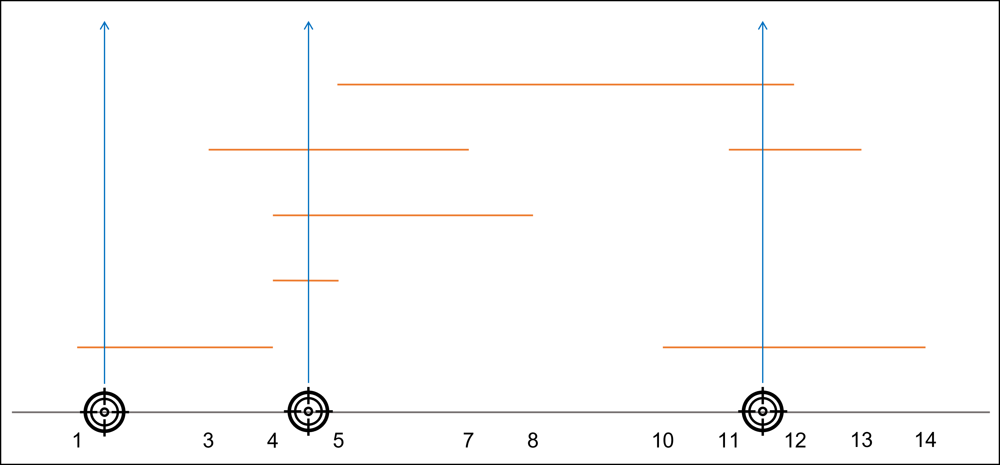

# 문제
A 나라가 B 나라를 침공하였습니다. B 나라의 대부분의 전략 자원은 아이기스 군사 기지에 집중되어 있기 때문에 A 나라는 B 나라의 아이기스 군사 기지에 융단폭격을 가했습니다.
A 나라의 공격에 대항하여 아이기스 군사 기지에서는 무수히 쏟아지는 폭격 미사일들을 요격하려고 합니다. 이곳에는 백발백중을 자랑하는 요격 시스템이 있지만 운용 비용이 상당하기 때문에 미사일을 최소로 사용해서 모든 폭격 미사일을 요격하려 합니다.
A 나라와 B 나라가 싸우고 있는 이 세계는 2 차원 공간으로 이루어져 있습니다. A 나라가 발사한 폭격 미사일은 x 축에 평행한 직선 형태의 모양이며 개구간을 나타내는 정수 쌍 (s, e) 형태로 표현됩니다. B 나라는 특정 x 좌표에서 y 축에 수평이 되도록 미사일을 발사하며, 발사된 미사일은 해당 x 좌표에 걸쳐있는 모든 폭격 미사일을 관통하여 한 번에 요격할 수 있습니다. 단, 개구간 (s, e)로 표현되는 폭격 미사일은 s와 e에서 발사하는 요격 미사일로는 요격할 수 없습니다. 요격 미사일은 실수인 x 좌표에서도 발사할 수 있습니다.
각 폭격 미사일의 x 좌표 범위 목록 targets이 매개변수로 주어질 때, 모든 폭격 미사일을 요격하기 위해 필요한 요격 미사일 수의 최솟값을 return 하도록 solution 함수를 완성해 주세요.

제한 사항
1 ≤ targets의 길이 ≤ 500,000
targets의 각 행은 [s,e] 형태입니다.
이는 한 폭격 미사일의 x 좌표 범위를 나타내며, 개구간 (s, e)에서 요격해야 합니다.
0 ≤ s < e ≤ 100,000,000
입출력 예
targets	result
[[4,5],[4,8],[10,14],[11,13],[5,12],[3,7],[1,4]]	3
입출력 예 설명



위 그림과 같이 최소 세 번의 요격 미사일 발사로 전부 방어할 수 있습니다.

# 테스트 예제
테스트 1
입력값 〉	[[4, 5], [4, 8], [10, 14], [11, 13], [5, 12], [3, 7], [1, 4]]
기댓값 〉	3
실행 결과 〉	테스트를 통과하였습니다.

# 제출
```java
import java.util.*;

class Solution {
    class WrapData implements Comparable<WrapData> {
        int[] d;

        public WrapData(int[] d) {
            this.d = d;
        }

        public boolean canDestroyed(int x) {
            return (d[0] <= x) && (d[1] > x);
        }

        @Override
        public int compareTo(WrapData o) {
            if(this.d[0] == o.d[0]) {
                return this.d[1] - o.d[1];
            } else {
                return this.d[0] - o.d[0];
            }
        }

        @Override
        public String toString() {
            return Arrays.toString(d);
        }
    }
    public int solution(int[][] targets) {
        int answer = 0;
        
        TreeSet<WrapData> set = new TreeSet<>();
        for(int[] target : targets) {
            set.add(new WrapData(target));
        }

        while (!set.isEmpty()) {
            WrapData data = set.pollFirst();
            answer++;
            int e = data.d[1];
            for(int i=data.d[0]; i < e; i++) {
                while(!set.isEmpty() && set.first().canDestroyed(i)) {
                    WrapData o = set.pollFirst();
                    e = Math.min(e, o.d[1]);
                }

                if(set.isEmpty()) break;
            }
        }

        return answer;
    }
}
```

# 효율적
```java
import java.util.*;
class Solution {
    public int solution(int[][] targets) {
        PriorityQueue<int[]> pq = new PriorityQueue<>((x, y) -> x[0] == y[0] ? x[1] - y[1] : x[0] - y[0]);
        PriorityQueue<Integer> pqEnd = new PriorityQueue<>();
        for(int[] target : targets){
            pq.offer(target);
        }
        int count = 1;
        while(!pq.isEmpty()){
            int[] curr = pq.poll();
            if(pqEnd.isEmpty()){
                pqEnd.offer(curr[1]);
            }else{
                if(pqEnd.peek() > curr[0]){
                    pqEnd.offer(curr[1]);
                }else{
                    count++;
                    pqEnd.clear();
                    pqEnd.offer(curr[1]);
                }
            }
        }
        return count;
    }
}
```