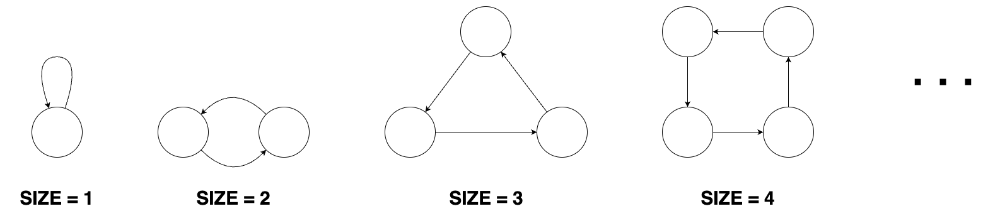
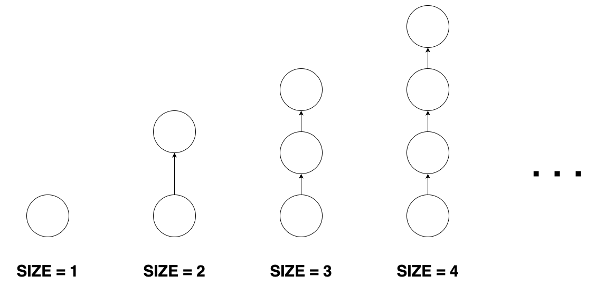
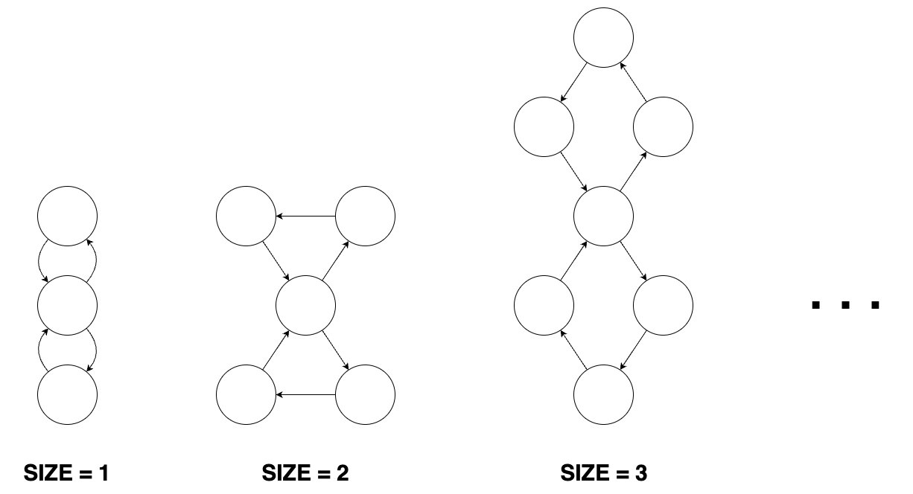
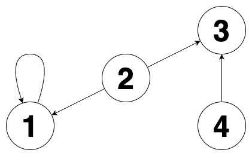
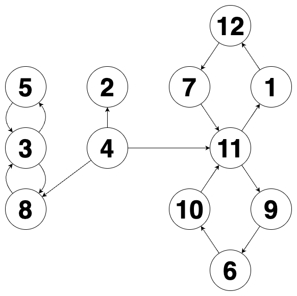

# 문제
도넛 모양 그래프, 막대 모양 그래프, 8자 모양 그래프들이 있습니다. 이 그래프들은 1개 이상의 정점과, 정점들을 연결하는 단방향 간선으로 이루어져 있습니다.

크기가 n인 도넛 모양 그래프는 n개의 정점과 n개의 간선이 있습니다. 도넛 모양 그래프의 아무 한 정점에서 출발해 이용한 적 없는 간선을 계속 따라가면 나머지 n-1개의 정점들을 한 번씩 방문한 뒤 원래 출발했던 정점으로 돌아오게 됩니다. 도넛 모양 그래프의 형태는 다음과 같습니다.



크기가 n인 막대 모양 그래프는 n개의 정점과 n-1개의 간선이 있습니다. 막대 모양 그래프는 임의의 한 정점에서 출발해 간선을 계속 따라가면 나머지 n-1개의 정점을 한 번씩 방문하게 되는 정점이 단 하나 존재합니다. 막대 모양 그래프의 형태는 다음과 같습니다.





크기가 n인 8자 모양 그래프는 2n+1개의 정점과 2n+2개의 간선이 있습니다. 8자 모양 그래프는 크기가 동일한 2개의 도넛 모양 그래프에서 정점을 하나씩 골라 결합시킨 형태의 그래프입니다. 8자 모양 그래프의 형태는 다음과 같습니다.




도넛 모양 그래프, 막대 모양 그래프, 8자 모양 그래프가 여러 개 있습니다. 이 그래프들과 무관한 정점을 하나 생성한 뒤, 각 도넛 모양 그래프, 막대 모양 그래프, 8자 모양 그래프의 임의의 정점 하나로 향하는 간선들을 연결했습니다.
그 후 각 정점에 서로 다른 번호를 매겼습니다.
이때 당신은 그래프의 간선 정보가 주어지면 생성한 정점의 번호와 정점을 생성하기 전 도넛 모양 그래프의 수, 막대 모양 그래프의 수, 8자 모양 그래프의 수를 구해야 합니다.

그래프의 간선 정보를 담은 2차원 정수 배열 edges가 매개변수로 주어집니다. 이때, 생성한 정점의 번호, 도넛 모양 그래프의 수, 막대 모양 그래프의 수, 8자 모양 그래프의 수를 순서대로 1차원 정수 배열에 담아 return 하도록 solution 함수를 완성해 주세요.

제한사항
1 ≤ edges의 길이 ≤ 1,000,000
edges의 원소는 [a,b] 형태이며, a번 정점에서 b번 정점으로 향하는 간선이 있다는 것을 나타냅니다.
1 ≤ a, b ≤ 1,000,000
문제의 조건에 맞는 그래프가 주어집니다.
도넛 모양 그래프, 막대 모양 그래프, 8자 모양 그래프의 수의 합은 2이상입니다.
입출력 예
edges	result
[[2, 3], [4, 3], [1, 1], [2, 1]]	[2, 1, 1, 0]
[[4, 11], [1, 12], [8, 3], [12, 7], [4, 2], [7, 11], [4, 8], [9, 6], [10, 11], [6, 10], [3, 5], [11, 1], [5, 3], [11, 9], [3, 8]]	[4, 0, 1, 2]
입출력 예 설명
입출력 예 #1

주어진 그래프를 그림으로 나타내면 다음과 같습니다.



2번 정점이 생성한 정점이고 도넛 모양 그래프 1개, 막대 모양 그래프 1개가 존재합니다. 따라서 [2, 1, 1, 0]을 return 해야 합니다.

입출력 예 #2

주어진 그래프를 그림으로 나타내면 다음과 같습니다.



4번 정점이 생성한 정점이고 막대 모양 그래프 1개, 8자 모양 그래프 2개가 존재합니다. 따라서 [4, 0, 1, 2]를 return 해야 합니다.

※ 공지 - 2024년 1월 23일 테스트 케이스가 추가되었습니다. 기존에 제출한 코드가 통과하지 못할 수도 있습니다.

# 테스트 예제
테스트 1
입력값 〉	[[2, 3], [4, 3], [1, 1], [2, 1]]
기댓값 〉	[2, 1, 1, 0]
실행 결과 〉	
테스트 2
입력값 〉	[[4, 11], [1, 12], [8, 3], [12, 7], [4, 2], [7, 11], [4, 8], [9, 6], [10, 11], [6, 10], [3, 5], [11, 1], [5, 3], [11, 9], [3, 8]]
기댓값 〉	[4, 0, 1, 2]
실행 결과 〉	

# 제출
```kotlin
class FindRootAndGraph(edges: Array<IntArray>) {
    val answer:IntArray = IntArray(4) { 0 }

    init {
        val edgeMap:MutableMap<Int, Pair<Int, Int>> = HashMap()
        val rootNodeEstimated:MutableSet<Int> = HashSet()
        val toNodes:MutableSet<Int> = HashSet()
        val startGraphVectors:MutableSet<Int> = HashSet()
        var root = 0
        edges.forEach {
            val (from, to) = it
            toNodes.add(to)
            if(edgeMap.containsKey(from)) {
                val (first, second) = edgeMap[from]!!
                if(second != 0) { // 3개 이상의 간선을 가진 노드는 루트만 존재
                    if(root == 0) {
                        root = from
                    }
                    startGraphVectors.add(to)
                } else {
                    if(root == 0) { // 루트 노드가 확정되지 않은 경우 루트일 가능성이 있다
                        rootNodeEstimated.add(from)
                    }
                    edgeMap[from] = Pair(first, to)
                }
            } else {
                edgeMap[from] = Pair(to, 0)
            }
        }

        // 최저 케이스(그래프 2개)의 경우 방문하지 않은 노드를 찾아야함
        if(root == 0) { // two graph case
            rootNodeEstimated.forEach {
                if(!toNodes.contains(it)) {
                    root = it
                }
            }
        }

        // 조건상 반드시 2개 이상이므로 root에는 first, second가 있음
        val (first, second) = edgeMap[root]!!
        startGraphVectors.add(first)
        startGraphVectors.add(second)
        edgeMap.remove(root)

        var graphDonut = 0
        var graphBar = 0
        var graphEight = 0

        startGraphVectors.forEach {
            if(edgeMap.containsKey(it)) {
                var nextNode = edgeMap[it]!!
                if(nextNode.second != 0) { // 두 개 이상의 간선은 8자형만 가진다
                    graphEight++
                } else if(nextNode.first == it) { // 첫 노드가 스스로에게 돌아오는 케이스는 반드시 도넛형이다
                    graphDonut++
                } else {
                    while (true) {
                        if(nextNode.second != 0) { // 노드를 돌다가 2개 이상의 간선을 지닌 노드를 만나면 더이상 탐색할 필요가 없다
                            graphEight++
                            break
                        } else if(edgeMap.containsKey(nextNode.first)) {
                            if(nextNode.first == it) { // 노드를 돌다가 시작점으로 왔을 때 까지 2개 이상의 간선을 지닌 노드가 없다면 도넛형이다
                                graphDonut++
                                break
                            } else {
                                nextNode = edgeMap[nextNode.first]!!
                            }
                        } else { // 노드를 돌더가 연결된 간선이 더이상 없으면 바형이다
                            graphBar++
                            break
                        }
                    }
                }
            } else { // 연결된 간선이 더 이상 없는 경우는 반드시 바형이다
                graphBar++
            }
        }

        answer[0] = root
        answer[1] = graphDonut
        answer[2] = graphBar
        answer[3] = graphEight
    }
}
```